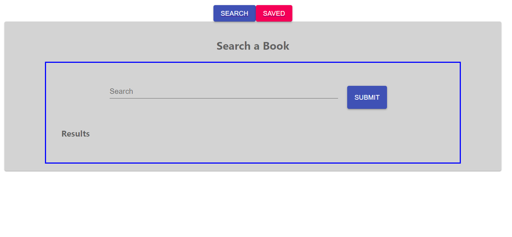

# HW20-Google Books

### GitHub Repo: https://github.com/AldoCarrillo/HW21-Books

### Heroku: https://obscure-anchorage-38518.herokuapp.com/

### Video: https://drive.google.com/file/d/1yJX2Ork3xhSXTHi5P4HsmOAl8R_2zeti/view

## Description

What this project does is list of Book you search from the Google Books API.

-   Book
    -       Title
    -       Author
    -       Description
    -       Picture
    -       Link

You can Search the Book by Title Name

## Table of contents

-   [Installation](#installation)
-   [Usage](#usage)
-   [Test](#test)
-   [Credits](#credits)
-   [License](#license)
-   [Questiones](#Questiones)

## Installation

Run the terminal the main file called "npm start" with Node and "nodemon server.js" for LocalHost or open de Heroku App link.

## Usage

-   Website load a list of book based in the info you typed.
-   Once you have the list of book you can click the Button Add+ to add the book to your Saved Books .
-   To change to Saved Book click on the top part where "Saved" botton is.
-   To Delete a Saved Book click in the Button "Delete".

## Main Page

## Test

"Node server.js"

Go to http://localhost:3000/ 

Type a name on the input text

Check the table below

## Credits

-   Aldo Carrillo

## License

MIT License

Copyright (c) 2020 Aldo Carrillo

Permission is hereby granted, free of charge, to any person obtaining a copy
of this software and associated documentation files (the "Software"), to deal
in the Software without restriction, including without limitation the rights
to use, copy, modify, merge, publish, distribute, sublicense, and/or sell
copies of the Software, and to permit persons to whom the Software is
furnished to do so, subject to the following conditions:

The above copyright notice and this permission notice shall be included in all
copies or substantial portions of the Software.

THE SOFTWARE IS PROVIDED "AS IS", WITHOUT WARRANTY OF ANY KIND, EXPRESS OR
IMPLIED, INCLUDING BUT NOT LIMITED TO THE WARRANTIES OF MERCHANTABILITY,
FITNESS FOR A PARTICULAR PURPOSE AND NONINFRINGEMENT. IN NO EVENT SHALL THE
AUTHORS OR COPYRIGHT HOLDERS BE LIABLE FOR ANY CLAIM, DAMAGES OR OTHER
LIABILITY, WHETHER IN AN ACTION OF CONTRACT, TORT OR OTHERWISE, ARISING FROM,
OUT OF OR IN CONNECTION WITH THE SOFTWARE OR THE USE OR OTHER DEALINGS IN THE
SOFTWARE.

## Questiones

-   GitHub link: https://github.com/AldoCarrillo
-   Email: aldo.carrillo22@gmail.com
